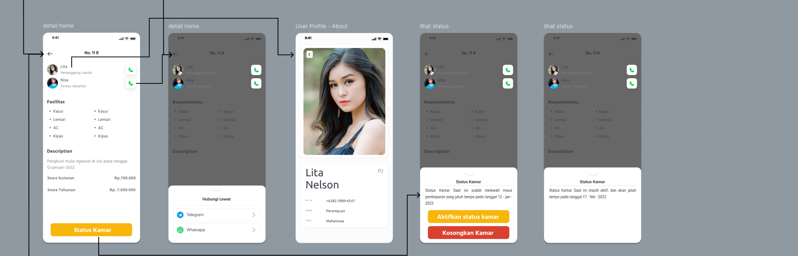
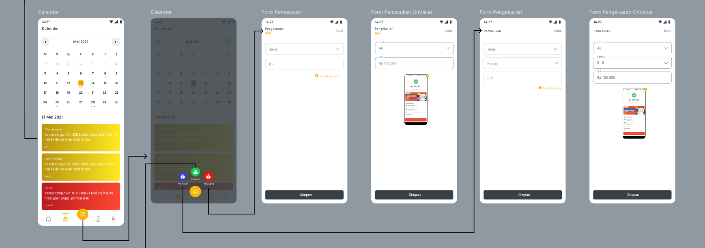
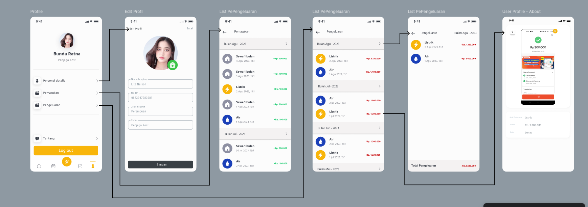

# HomeStay - Aplikasi Manajemen Kost

**HomeStay** adalah aplikasi mobile yang membantu pemilik kost untuk mengelola penghuni, memantau pemasukan dan pengeluaran, serta menerima notifikasi terkait aktivitas kost.

## Fitur Utama
- **Manajemen Penghuni Kost**: Kelola informasi penghuni, status pembayaran, dan data penting lainnya.
- **Pemantauan Keuangan**: Catat pemasukan dan pengeluaran bulanan untuk analisis keuangan yang lebih baik.
- **Laporan Ringkasan**: Visualisasi data pemasukan dan pengeluaran dalam grafik.
- **Notifikasi Real-Time**: Gunakan Firebase Cloud Messaging (FCM) untuk menerima pengingat pembayaran atau notifikasi penting.
- **Antarmuka Modern**: Desain responsif yang mudah digunakan.

## Teknologi yang Digunakan
- **Flutter**: Framework utama untuk pengembangan aplikasi mobile.
- **GetX**: State management yang efisien dan reaktif.
- **Firebase**: Backend untuk autentikasi, database, dan pengiriman notifikasi.
- **FCM Server Notifications**: Memberikan notifikasi real-time ke perangkat pengguna.

## Screenshot








<!-- ## Instalasi

### Prasyarat
- **Android** minimal versi 8.0 (Oreo) atau lebih baru.
- **Flutter SDK** versi terbaru.
- Koneksi internet untuk sinkronisasi data dengan Firebase.

### Langkah Instalasi
1. Clone repositori ini:
   ```bash
   git clone https://github.com/username/HomeStay.git -->
